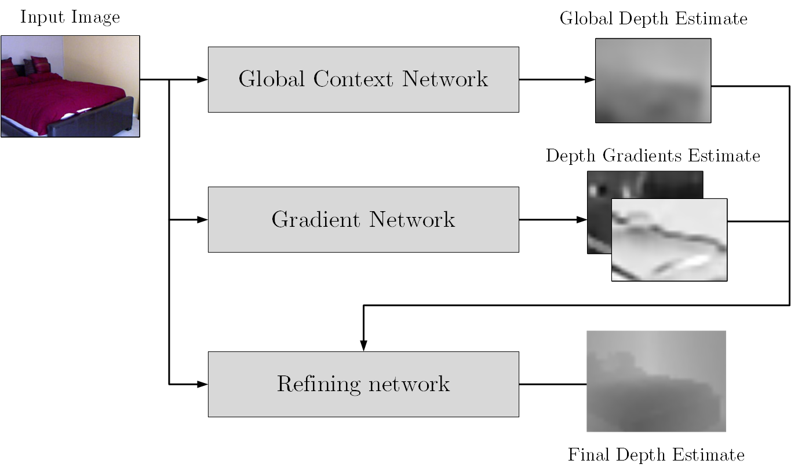
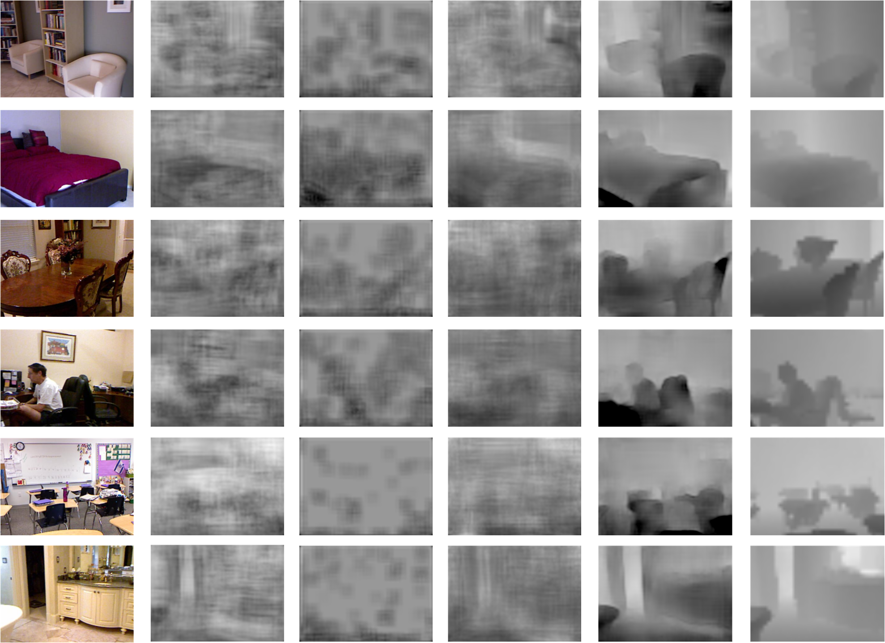
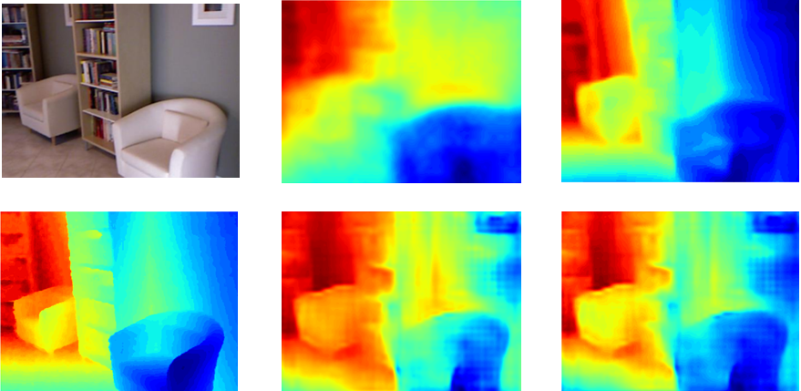

# Depth Estimation by Convolutional Neural Networks

This is a repository for my master's thesis - Depth estimation by CNNs. You can read the whole thesis 
<a href="http://www.fit.vutbr.cz/study/DP/DP.php?id=18852&file=t"> here</a>. Here I briefly present the solution and results. 

## Architecture:

I use architecture similar to the one used by <a href="http://www.cs.nyu.edu/~deigen/depth/">Eigen <i>et al.</i></a> with the difference, that I also use network that estimates 
gradients of the depth map:

For the global context network I use pretrained AlexNet, gradient network is a convolutional part of AlexNet,
and the refining network is also fully convolutional, more details in the thesis. I trained each part separately, 
first global context network and the gradient network, after that I fixed their parameters and trained the refining network.

### Normalized loss function:

For training the global context network and the refining network I wanted to use scale invariant loss, similar to the one used by <a href="http://www.cs.nyu.edu/~deigen/depth/">Eigen <i>et al.</i></a>, but I took it a step 
further and I used loss function that is scale-and-translation invariant. I would put an equation here, but I couldn't find how to 
do that easy. Luckily - it can be explained fairly easily in words: to obtain normalized depth map you just subtract its mean and divide by its variance.
Normalized loss is just a squared distance between normalized output depth map and the target depth map. This showed to improve speed of convergence significantly.

## Trained model

You can download the trained model <a href="https://dl.dropboxusercontent.com/u/65091385/model_norm_abs_100k.caffemodel">here</a>.

## Results:

I made several experiments for the thesis, you can have a look at all of them in the chapter 5 of the thesis. Here I present just
the most significant ones. All experiments were performed  on <a href="http://cs.nyu.edu/~silberman/datasets/nyu_depth_v2.html">NYU Depth v2</a> dataset.

### Comparison of different loss functions

I trained the refining network with different loss functions for 60 000 iterations.

<b>

From left to right: input; squared distance loss; squared distance loss in log space; scale invariant loss by Eigen <i>et al.</i>; normalized loss; ground truth

</b>

As you can see, networks utilizing other loss functions produce ineligible outputs compared to network using normalized loss. Difference
is reduced when the network is trained longer (Eigen <i>et al.</i> ran the training for ~1.5M iterations, here it's just 60k).

### Comparison to existing solutions

How does the model fare against existing solutions?
I compared results of my model to the results from <a href="http://arxiv.org/abs/1406.2283">this [1]</a> and <a href="https://arxiv.org/abs/1411.4734">this [2]</a> papers, both by Eigen <i>et al.</i>. 
Model with normalized loss has trouble estimating absolute depth values, but it estimates relative structure of the depth map fairly well. 
To test this I substitued mean and variance of the ground truth to the output depth map and this model I called 'model with oracle'. 
It achieves state of the art performance in RMSE metric at the time of writing the thesis. Keep in mind that this model just aims to prove
that model trained with normalized loss estimates the structure of the depth map well, regardless of absolute depth values.

|                 | [1]           | [2]   | Proposed model | With Oracle |
| :-------------  | -------------:| -----:| --------------:| -----------:|
| <b>RMSE</b>     |    0.907      | 0.641 | 1.169          | 0.569       |

<b>

From left to right by columns: input image, ground truth; [1], proposed model; [2], model with oracle

</b>

## Usage

`python test_depth.py INPUT_DIR GT_DIR OUT_DIR SNAPSHOTS_DIR [--log]`

- `INPUT_DIR` is the path to the folder containing input images
- `GT_DIR` is the path to the folder containing ground truth depth maps
- `OUT_DIR` is the path to the folder to which will be written output depth maps
- `SNAPSHOTS_DIR` is the path to the folder containing .caffemodel files containing trained network models. All models from this folder will be evaluated.
- `--log` switch is used when the depth values that are produced by the network are in log space

### Frameworks/Libraries needed:

* Caffe
* Python2.7: caffe, scipy, scikit-image, numpy, pypng, cv2, Pillow, matplotlib

### Few notes
- input images should be named in a same way as the corresponding ground truths, with difference that input images should have a suffix 'colors', while ground truth images should have a suffix 'depth'. Note that these suffixes should preceed file extension, e.g., 'image1_colors.png' and corresponding depth map 'image1_depth.png'
- along with .caffemodel file, corresponding deploy network definition file has to be placed into SNAPSHOTS_DIR, with the same name as the model file but with different extension 'prototxt' instead of 'caffemodel'
- there will actually be two output folders created, one OUT_DIR and the other OUT_DIR + '_abs'. OUT_DIR contains output depths that are fit using MVN normalization onto ground truth, OUT_DIR + '_abs' contains the raw output depth maps.
- note that you need AlexNet caffemodel for the training of the global context network, gradient network and their joint configuration. It can be downloaded here: https://github.com/BVLC/caffe/tree/master/models/bvlc_alexnet
